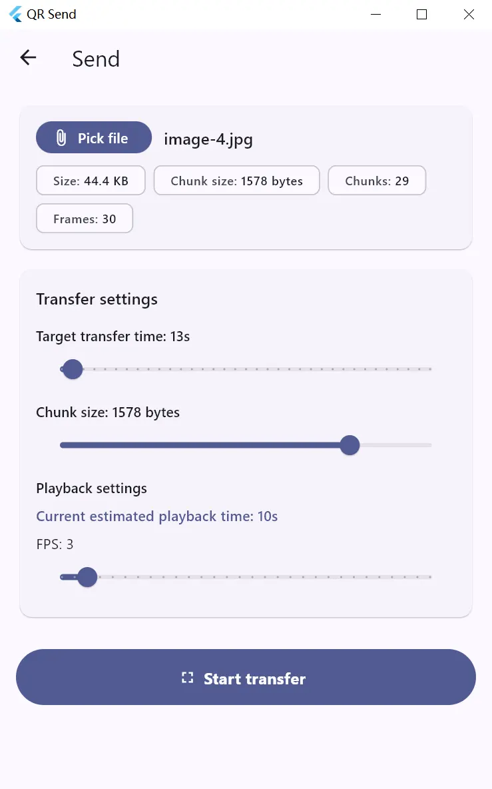
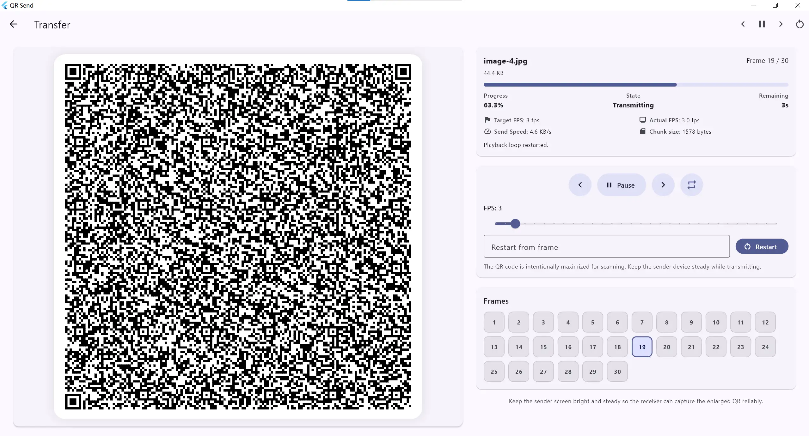
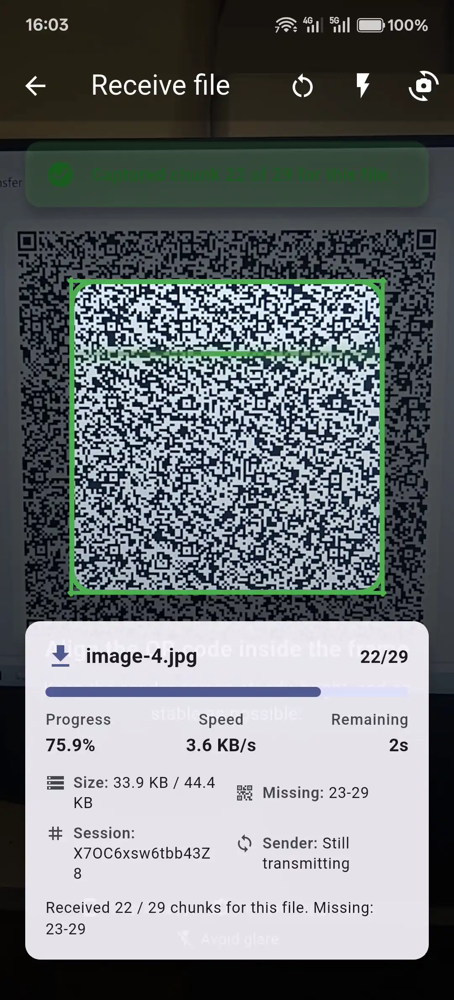

# QR Send

**Send Files via Streaming QR Codes**

QR Send is an experimental Flutter application that enables file transfer through a sequence of dynamically generated QR codes. The sender splits any file into chunks and displays them as a continuous stream of QR codes, while the receiver scans these codes with their camera to reconstruct and save the original file locally.

> [!WARNING]
> ⚠️ This is an experimental project created through vibe coding
>   - It's functional but may be unstable
>   - Not recommended for transferring sensitive or important data
>   - Not recommended for large files
>   - Use at your own risk

## How It Works

QR Send leverages a purely visual data transmission method, operating completely offline without any network connectivity.

**Sender**
1. Select any file from your device
2. The app splits the file into small chunks
3. Each chunk is encoded as a QR code
4. QR codes are displayed in sequence for scanning

**Receiver**
1. Point your camera at the sender's screen to scan the flowing QR codes
2. The app automatically parses the scanned data from each QR code and intelligently reassembles the chunks
3. Once all chunks are received and verified, the original file is reconstructed and saved locally on the receiver's device

**Truly Offline Transfer**: All transmission happens purely through visual data - **No Wi-Fi, Bluetooth, or any network connection required**

## Screenshots

  
  
  

## Demo Video

...

## Limitations

- The receiver device must have a functional camera to scan the QR codes
- **Transfer speed is slow.** Speed depends on QR decoding efficiency and scanning reliability. --averaging **2KB/s**, with a tested peak of **4KB/s** under optimal conditions.
- Intended for small text files

## License

[MIT License](./LICENSE)
